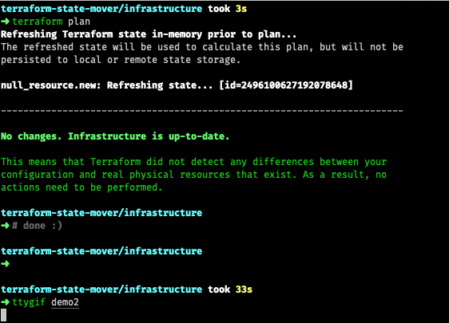

# Terragrunt State Mover

**This is a simple fork replacing terraform executable to make it work with terragrunt projects.** 

Helps refactoring terragrunt code by offering an interactive prompt for the [`terragrunt state mv`](https://www.terraform.io/docs/commands/state/mv.html) command.

## Installation

build it yourself using 

```bash
go get github.com/mbode/terraform-state-mover
```

or clone repository and run 

```bash
go build
```

## Usage

```bash
terragrunt-state-mover 
```

Extra arguments after a `--` are passed to the `terragrunt plan` call. This makes the following possible:

## Demo



## Contributing
Pull requests are welcome. Please make sure to update tests as appropriate.

## License
[MIT](https://choosealicense.com/licenses/mit/)
